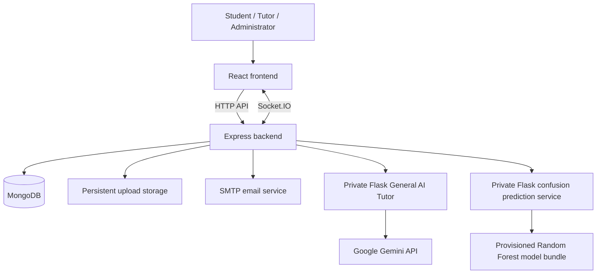

# EDUNova Project Report

**Project:** EDUNova — Online Learning Platform with an AI Tutor and Student Confusion Analytics  
**Report date:** 11 September 2026  
**Basis:** Current source code, local verification results, and the saved machine-learning evaluation report. Implemented features are distinguished from live deployment verification and future work.

## 1. Executive overview

EDUNova is a web-based learning platform serving students, tutors, and administrators. It combines course discovery, lesson delivery, enrollment, manual payment verification, communication, and learning-progress tracking. Two Python services extend the core application: a Gemini-powered General AI Tutor and a Random Forest service that estimates lesson confusion from learning activity.

The system is implemented as a React frontend, an Express API backed by MongoDB, and two private Flask services. The application builds successfully and its automated checks pass following targeted policy, session, payment, and messaging fixes. Public production readiness still depends on live deployment validation.

## 2. Problem and objectives

An online learning platform needs more than a course catalogue: students need access to lessons and support, tutors need tools to manage content and understand learning difficulties, and administrators need control over accounts, publication, and payments.

EDUNova addresses these needs through the following objectives:

- Provide separate student, tutor, and administrator workflows.
- Support course discovery, enrollment, protected lesson resources, and progress tracking.
- Manage tutor applications and course moderation.
- Support QR-based payment instructions, payment-slip submission, and administrator verification.
- Provide general educational explanations through an AI tutor.
- Collect behavioural learning signals and optional clarity feedback.
- Summarize predicted confusion by lesson so tutors can identify material that may need attention.
- Protect sessions, private documents, and user-owned records through backend authorization.

## 3. Users and implemented features

### 3.1 Students

| Area | Implemented capability |
|---|---|
| Accounts | Registration, login, logout, session restoration, and password-reset flow |
| Course discovery | Course listing, search, course details, and favorites |
| Enrollment | Free-course enrollment and purchase-related enrollment workflows |
| Checkout | Cart, orders, payment information, and payment-slip submission |
| Learning | Lesson navigation, uploaded primary media, supporting resources, and external references |
| Progress | Lesson completion, video position, study activity, and persisted enrollment progress |
| Notes | Create, edit, and delete private notes associated with lessons |
| Lesson support | Tutor-provided summaries and transcripts where supported |
| AI assistance | General educational questions and user-owned conversation history |
| Feedback | Optional clear/confused feedback, kept separate from model predictions |
| Communication | Messaging and notifications |
| Tutor applications | Submit an application with supporting documents and review application status |

The General AI Tutor does not retrieve EDUNova course documents. Summaries and transcripts are tutor-provided content rather than automatically generated course analysis.

### 3.2 Tutors

| Area | Implemented capability |
|---|---|
| Dashboard | Tutor-facing course, student, and analytics views |
| Profile | View and edit tutor profile information and profile image |
| Course authoring | Create and edit courses and submit them for moderation |
| Lesson management | Add and edit lessons, media, supporting resources, summaries, and transcripts |
| Communication | Messaging through the platform |
| Analytics | Aggregated lesson confusion predictions for owned courses |

### 3.3 Administrators

| Area | Implemented capability |
|---|---|
| Accounts | Student and tutor management, including account-status changes |
| Tutor applications | Review application details and protected supporting documents |
| Courses | Review and moderate courses |
| Payments | Configure payment details and QR image; approve or reject submitted payment slips |
| Reports | Review submitted reports |
| Announcements | Create and remove platform announcements |
| Settings | Edit platform policy values and categories |
| Audit | View recorded administrative activity |

Some policy controls are stored but not connected to enforcement. These are documented in Section 10.

## 4. System architecture

The frontend renders the user interface and calls the backend. Express validates authentication and permissions, manages database records and files, and calls the private Python services. Socket.IO supports real-time messaging. Uploaded files require persistent disk storage in production. The Python services should not be exposed as public application endpoints.

### Main project directories

| Directory | Purpose |
|---|---|
| `frontend/` | React pages, components, hooks, styles, and client utilities |
| `backend/` | Express routes, Mongoose models, middleware, services, and tests |
| `chatbot-service/` | Flask General AI Tutor and Gemini integration |
| `confusion-service/` | Dataset export, model training, evaluation, prediction API, and tests |
| `docs/` | Project and deployment documentation |

## 5. Technologies and tools

| Layer | Tools used | Purpose |
|---|---|---|
| Frontend | React 19, JavaScript, CSS | Component-based interface and styling |
| Routing | React Router DOM | Client-side navigation and role-specific routes |
| Build | Vite 8 | Development server and optimized frontend build |
| UI icons | React Icons | Interface iconography |
| Backend | Node.js, Express 5 | API server and business logic |
| Database | MongoDB, Mongoose 9 | Document persistence, schemas, and indexes |
| Real-time communication | Socket.IO | Messaging events |
| Authentication | JSON Web Tokens, bcryptjs, Node crypto | Access tokens, password hashing, and refresh-token generation/hashing |
| HTTP protection | Helmet, CORS, express-rate-limit | Security headers, origin restrictions, and request limits |
| File handling | Multer | Multipart uploads |
| Email | Nodemailer and SMTP | Email delivery workflows |
| Python APIs | Python, Flask, Gunicorn | AI service endpoints and production serving |
| Generative AI | Google Gen AI SDK and Gemini | General educational responses |
| Machine learning | scikit-learn RandomForestClassifier | Binary confusion estimation |
| Data processing | pandas, NumPy, PyMongo | Dataset preparation and MongoDB access |
| Model persistence | joblib | Saving and loading trained model bundles |
| Configuration | dotenv / python-dotenv | Environment-based configuration |
| Verification | Node test runner, Python unittest, ESLint | Automated tests and frontend linting |
| Version control | Git and npm lockfiles | Source history and JavaScript dependency resolution |

Major versions above describe the current project stack, not a guarantee that every clean installation will resolve identical versions. The saved model report records Python 3.10.11 and scikit-learn 1.7.2 for its training environment.

## 6. Data design

The main MongoDB models include:

- **User and RefreshSession:** identities, account state, and persistent session records.
- **Course and Enrollment:** course content, student access, and progress.
- **TutorApplication:** application information and supporting document metadata.
- **Cart, Order, and PaymentSetting:** selected courses, purchase workflow, payment evidence, and payment instructions.
- **Note:** private student notes.
- **Message, Notification, and Announcement:** communication and platform updates.
- **ChatbotConversation:** user-owned AI conversation records.
- **LearningSignal:** one record per student, course, and lesson containing activity, feedback, and the latest stored prediction.
- **Report, AdminAudit, and PlatformSetting:** reporting, administrative activity, and policy configuration.

Files are stored on disk, while database records retain their metadata and references. Database and upload backups must therefore be coordinated.

## 7. General AI Tutor

An authenticated user submits a question through the frontend. Express applies authorization and rate limiting, loads bounded general conversation history belonging to that user, and calls the private Flask service. The service requests an answer from Gemini and returns it through Express.

The implementation rejects course-mode requests and course-specific retrieval fields. It does not send lesson documents, notes, or transcripts to Gemini for course-grounded answers. Responses are presented as unverified general knowledge. Provider failures, quota errors, malformed responses, and timeouts have bounded error handling.

A configured API key alone does not prove live availability. The selected model, project permissions, provider quota, and network access require deployment verification.

## 8. Student confusion prediction

### 8.1 Inputs and labels

The Random Forest uses exactly six inputs:

| Input | Meaning |
|---|---|
| `maximumVideoProgressPercent` | Highest recorded video progress |
| `activeTimeSeconds` | Accumulated active lesson time |
| `pauseCount` | Recorded pauses meeting the tracking rules |
| `replayCount` | Recorded qualifying backward seeks |
| `visitCount` | Recorded lesson visits |
| `lessonCompleted` | Completion state encoded as 0 or 1 |

Student feedback supplies the training label: clear = 0 and confused = 1. Feedback is not an input feature. Identifiers, private messages, notes, and transcripts are excluded from the model feature matrix. An anonymous student group is used for splitting so that a student's records do not appear in both training and test sets.

### 8.2 Saved training run

Source: `confusion-service/reports/generated/confusion-random-forest-3b-v1.json`.

| Item | Recorded value |
|---|---:|
| Model | RandomForestClassifier |
| Version | 3b-v1 |
| Training date, UTC | 7 September 2026 |
| Trees | 200 |
| Class weighting | balanced |
| Random seed | 42 |
| Decision threshold | 0.5 |
| Database name recorded by run | test |
| Source records | 72 |
| Valid labelled records | 71 |
| Unlabelled records | 1 |
| Unique students | 16 |
| Clear / confused labels | 27 / 44 |
| Training records / students | 53 / 12 |
| Test records / students | 18 / 4 |

These are reported dataset counts. The report alone does not independently establish how the source participants or records were collected.

### 8.3 Evaluation results

| Metric | Result |
|---|---:|
| Accuracy | 66.67% |
| Balanced accuracy | 65.00% |
| Confused-class precision | 66.67% |
| Confused-class recall | 80.00% |
| Confused-class F1 | 72.73% |
| ROC-AUC | 0.7063 |
| Majority-class baseline accuracy | 55.56% |

| Actual class | Predicted clear | Predicted confused |
|---|---:|---:|
| Clear | 4 | 4 |
| Confused | 2 | 8 |

The model identified 8 of 10 confused test cases, but also classified 4 of 8 clear cases as confused. Accuracy exceeded the recorded baseline by 11.11 percentage points. The test set contains only 18 records from four students, so these results are preliminary and do not establish general reliability.

Active time accounts for approximately 76.46% of the recorded feature importance. This describes the fitted model's reliance on that input; it does not establish that longer study time causes confusion.

### 8.4 Prediction and tutor heatmap

The prediction service loads a saved model bundle and accepts the six validated inputs. Express stores predictions separately from self-reported feedback. Tutor analytics aggregates valid predictions for owned courses rather than exposing individual student identities in the heatmap.

Lessons with fewer than five valid predictions display an insufficient-data state. For eligible lessons, the confusion levels are low at 0–39%, medium at 40–69%, and high at 70–100%.

Predictions are indicators for tutor review, not proof of a student's mental state or a basis for automatic grading.

## 9. Security and verification

Implemented protections include password hashing, backend role checks, current-account validation, short-lived access tokens held in memory, rotating refresh tokens with hashed database storage, production Secure/HttpOnly cookies, CORS allowlists, request limits, protected file routes, and bounded request bodies. Sensitive environment files and generated model artifacts are excluded from Git.

These controls do not constitute a complete security audit.

The latest checks performed during this review were:

| Check | Result |
|---|---|
| Backend syntax checks | Passed |
| Backend automated tests | 64 passed |
| Frontend automated tests | 50 passed |
| General AI Tutor tests | 6 passed |
| Confusion-service tests | 17 passed |
| Frontend ESLint | Passed after the LessonNotes effect fix |
| Frontend production build | Passed; bundle-size warning remains |

All 137 automated tests passed across the reviewed runs. This includes focused checks for enrollment policy, absolute session deadlines, and production configuration. Tests include isolated and mocked cases and are not evidence that every browser workflow or external integration has been exercised live.

The frontend fix resets the lesson-notes component when its lesson or account context changes, removing synchronous state resets from the loading effect.

## 10. Known functional gaps and limitations

| Finding | Current impact |
|---|---|
| Assessment grading is not implemented | The passing-score setting is visibly disabled and no longer accepted by the admin API; no grading workflow has been invented |
| Live integration verification remains outstanding | SMTP, Gemini, TLS, production MongoDB transactions, storage, and full browser journeys need staging checks |
| Small confusion evaluation dataset | Predictive reliability across new students and courses is not established |
| AI Tutor is general-mode only | It cannot answer using retrieved EDUNova course materials |
| Tutor-provided summaries/transcripts | Automatic document summarization and transcription are not implemented by this workflow |
| Large frontend JavaScript bundle | Build succeeds, but loading performance could benefit from code splitting |
| Live integration verification remains outstanding | Email, Gemini, payment workflows, storage, and full browser journeys need staging checks |

The confusion-service README also contains historical phase descriptions alongside newer prediction and heatmap documentation. The current implementation and saved report should be used when describing what exists today.

## 11. Deployment requirements

A production installation requires a static frontend host, Node.js API process, MongoDB, persistent upload storage, and two private Python service processes. Configure HTTPS, API routing, Socket.IO upgrades, allowed origins, production secrets, SMTP, and provider access. Use Gunicorn for the Python services and provision the model bundle separately because generated models are ignored by Git.

Set the frontend API origin at build time when using a separate API origin. Keep frontend and API same-site for the current refresh-cookie policy. Configure proxy trust only for the actual trusted proxy arrangement. Verify backup restoration for both MongoDB and uploads.

The current assessment is suitable for staging preparation, with public launch pending functional fixes and live validation. Detailed operational instructions are in `docs/PRODUCTION.md`.

## 12. Recommended next development work

1. Connect or remove the ineffective admin policy controls and centralize enrollment policy checks across checkout and direct enrollment.
2. Add focused regression coverage for those policy behaviours.
3. Exercise student, tutor, and administrator journeys in staging, including session refresh, uploads, payment verification, messaging, and AI failures.
4. Expand and document the labelled learning dataset; evaluate on additional held-out students and courses.
5. Review prediction errors and threshold choices before expanding reliance on confusion analytics.
6. Improve frontend loading through route-level code splitting.
7. Add deployment monitoring, backup-restore verification, and continuous integration checks.
8. Update historical documentation so it consistently reflects the current implementation.

## 13. Project status

EDUNova implements a substantial learning-platform foundation with course management, student learning tools, manual payment workflows, communication, general AI assistance, and a trained confusion-prediction pipeline. Its existing automated checks pass. Remaining work concerns specific policy gaps, live integration verification, production operations, and broader evidence for the machine-learning component.
